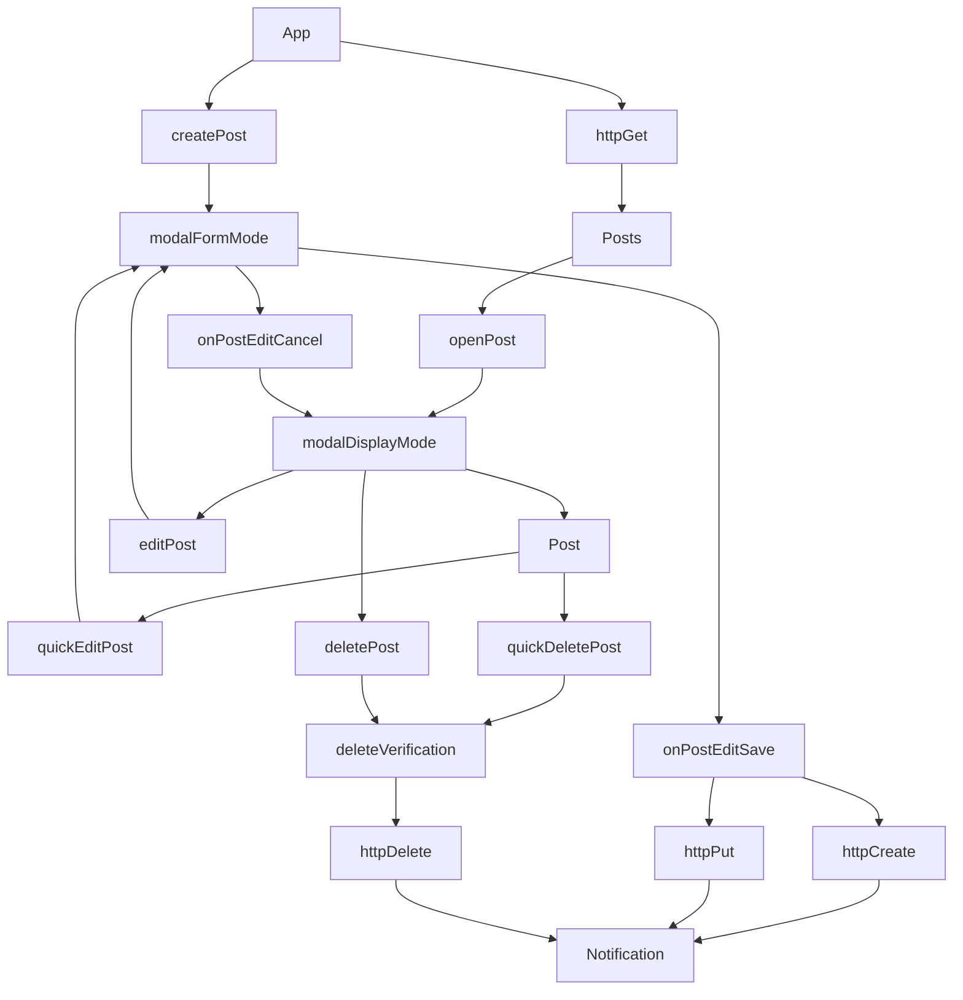

# A simple CRUD App

## Specifications

> Work while hosting your code on a private shared repository to allow us to
consult it.

Create a simple CRUD application using React and [JSONPlaceholder](https://jsonplaceholder.typicode.com/) API

- 🔴 Retrieve and display a list of posts
- 🔴 Create new post (showing a simple form in place that submit data)
displaying the created data when submitted
- 🔴 Delete a post (with a button for each element in the list)
- 🔴 Update a post (with a button for each element in the list, showing a form in
place with data to update) displaying the updated data when submitted
- 🔴 Show us your design skills, giving a better look to what you’ve done (using
pure CSS or a framework)

### Bonus:
- 🔴 Use a database or local storage to store the data
- 🔴 Display user feedbacks (e.g. toast messages) when needed
- 🔴 Use Typescript
- 🔴 Deploy

### Extra

- 🔴 Document the application inside `README.md`
- 🔴 Run some unit tests

> 🟢 Done   
> 🟠 Doing  
> 🔴 ToDo  

## Starting the app

To start the app, you will need Node.js and npm or yarn. 

- Make Sure `Node.js` and `npm` are installed. Open a terminal and type `node -v` to see the version of Node.js. If you get an error or your version is older than 16.0.0, you need to download the [latest version](https://nodejs.org/en/download/).
- Open a terminal in the root directory of the project, and install the npm packages required by running `npm install`.
- The application has a front end as well as a mock [JSON-server](https://www.npmjs.com/package/json-server) to act as a temporary backend endpoint for the data. We need both running at the same time to be able to view the app.

| Operation | Command |
|---|---|
| Start JSON-server | `npm run server` |
| Start React App | `npm run dev` |

> NOTE: By default, `JSON-server` runs on port 3000. Sometimes the port is not available which might cause the server to run on another port. In that case, create a `.env` file and add: `VITE_SERVER_URL='http://localhost:XXXX'`, where `XXXX` place the port that is mentioned in the terminal. Make sure you restart vite server after any change to `.env` file so that the changes take effect.

## API Schema

TODO

## Diagram Flow

TODO

## Technologies and Packages

This project has several dependencies. To find an exhaustive list please check `package.json`: `dependencies`, and `devDependencies`.

### Axios

Axios is the industry standard when it comes to HTTP requests. There are alternative methods of querying data, like [React Query](https://react-query-v3.tanstack.com/), but the project is simple at this stage, so there is no need for it.

### React

React, is considered the golden standard for developing web applications. It's well tested, well maintained with a huge ecosystem of other libraries that work out of the box with it. To create the app, I used Vite instead of CRA for [several reasons](https://vitejs.dev/guide/why.html).

### React Edit Text

Input handling is being managed by [React Edit Text](https://github.com/bymi15/react-edit-text) which is pretty straightforward to use even though it is not so popular. That being said, there were issues during development, which lead to some non best practices being followed namely for styling the components. 

### Tailwind CSS

[Tailwind CSS](https://tailwindcss.com/docs/installation) provides a quick and safe way to create a stylized template. The documentation is stellar, and the framework is well tested and used in production by many large companies. It also allows for a quick Dark theme mode, a feature which is utilized in this project. See [Theme section](https://github.com/madewithlove/technical-assignment-front-end-engineer-TheoKondak#theme) for more.

### Code Linting

For linting this project adopts the [Airbnb JavaScript Style Guide](https://github.com/airbnb/javascript).

## Theme

The colors of the theme, are inspired by the color palette used in [Tapioview.com](https://www.tapioview.com/). That being said, I used [TailwindCss color gamuts](https://tailwindcss.com/docs/customizing-colors) and tried to stick as close to the original values as possible.

## Issues

### Known Issues

At the moment there are no outstanding issues.

### Fixed Issues

At the moment there are no fixed issues.

## Resources

### Typescript

- https://react-typescript-cheatsheet.netlify.app/docs/basic/getting-started/basic_type_example/

### Tailwind CSS

- https://tailwindcss.com/docs/customizing-colors
- https://tailwindcss.com/docs/installation

### Setting Up the project (Vite, React, TypeScript, Vitest, Testing-Library, Eslint, Prettier)

- https://www.youtube.com/watch?v=cchqeWY0Nak&ab_channel=CodingGarden
- Vite & Vitest configuration file: https://github.com/vitest-dev/vitest/blob/main/examples/react-testing-lib-msw/vite.config.ts
- https://markus.oberlehner.net/blog/using-testing-library-jest-dom-with-vitest/

### Vitest, React Testing Library

- https://vitest.dev/api/
- https://testing-library.com/docs
- https://vitest.dev/guide/mocking.html
- https://stackoverflow.com/questions/74930606/mock-react-router-dom-useparams-hook-in-vitest
