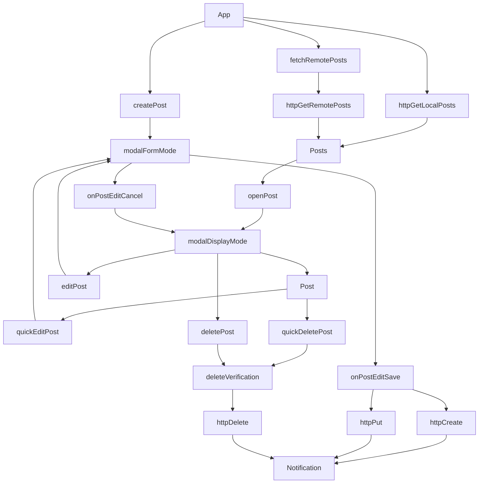

- [Crud App](#crud-app)
  - [About the app](#about-the-app)
    - [Header](#header)
    - [Masthead](#masthead)
    - [Posts list](#posts-list)
    - [Toast Message / Notifications](#toast-message--notifications)
    - [Some considerations](#some-considerations)
  - [Specifications](#specifications)
    - [Bonus:](#bonus)
    - [Extra](#extra)
  - [Starting the app](#starting-the-app)
    - [Setup JSON server to be able to work on localhost](#setup-json-server-to-be-able-to-work-on-localhost)
    - [Local Env setup](#local-env-setup)
  - [API Schema](#api-schema)
  - [Diagram Flow](#diagram-flow)
  - [Technologies and Packages](#technologies-and-packages)
    - [Axios](#axios)
    - [React](#react)
    - [React Edit Text](#react-edit-text)
    - [Tailwind CSS](#tailwind-css)
    - [Toasts](#toasts)
    - [Code Linting](#code-linting)
  - [Theme](#theme)
  - [Issues](#issues)
    - [Known Issues](#known-issues)
    - [Fixed Issues](#fixed-issues)
  - [Resources](#resources)
    - [Typescript](#typescript)
    - [Tailwind CSS](#tailwind-css-1)
    - [Setting Up the project (Vite, React, TypeScript, Vitest, Testing-Library, Eslint, Prettier)](#setting-up-the-project-vite-react-typescript-vitest-testing-library-eslint-prettier)
    - [Vitest, React Testing Library](#vitest-react-testing-library)
    - [Fix input lag for Input and Textarea](#fix-input-lag-for-input-and-textarea)
    - [React Markdown](#react-markdown)
    - [React Toastify](#react-toastify)


# Crud App


## About the app

This is a simple crud app, with a minimal approach to design. For displaying and editing posts, a modal was created.

The default view of the application is a simple CRUD view. 

### Header

On top there is a header with a logo, and a dark mode toggle button. 

- The logo settings, like source, alt, dimensions are being fetched by the API Server.

### Masthead

Then there is a masthead with a search input field, an `Add Post` button and a `Conjure` button.

- The search field searches the between the titles of the post.
- `Add Post`, pops the modal with an empty post.
- `Conjure` button fetches a post from [JSONPlaceholder](https://jsonplaceholder.typicode.com/). The new post adopts a new ID for the local database. The fetched post, must have either a unique title or body.

### Posts list

Bellow the masthead, there is a list of posts. If there are no posts in the database, a message is displayed. Otherwise a list of posts is displayed.

Each list item contains:

- Post ID
- Post Title
- Post Body
- User ID
- A set of actions:
  - View Post
  - Edit Post
  - Delete Post

From the modal, the user can edit:
 - Post Title
 - Post Body

The user can:
  - Save and close
  - Reset edits
  - Delete the post
  - Exit without saving

When a user tries to delete, or exit without saving, an alert is popping up to warn the user.

The body of the modal counts the characters and words of the current value of the textarea. The body also supports Github Markdown notation.

> At the moment not every element is styled, so some elements might not display properly when displayed in Markdown.

### Toast Message / Notifications

A toast message is displayed for every meaningful action like creating, saving,  deleting, fetching etc.

### Some considerations

- Adding a created/last edited dates for each post. And after that capabilities like history etc are easily achievable.
- The application is not ready to be deployed. There are some outstanding Typescript issues that need to be resolved before a build version could generated.
- The application will not run in `React.StrictMode`. Check the [unresolved issues](#known-issues) for more.
- Only manual testing was performed. Due to lack of time, no unit testing or other testing methods were implemented.

## Specifications

> Work while hosting your code on a private shared repository to allow us to
consult it.

Create a simple CRUD application using React and [JSONPlaceholder](https://jsonplaceholder.typicode.com/) API

- 🟢 Retrieve and display a list of posts
- 🟢 Create new post (showing a simple form in place that submit data)
displaying the created data when submitted
- 🟢 Delete a post (with a button for each element in the list)
- 🟢 Update a post (with a button for each element in the list, showing a form in
place with data to update) displaying the updated data when submitted
- 🟠 Show us your design skills, giving a better look to what you’ve done (using
pure CSS or a framework)

### Bonus:
- 🟢 Use a database or local storage to store the data
- 🟢 Display user feedbacks (e.g. toast messages) when needed
- 🟢 Use Typescript
- 🔴 Deploy
- 🟢 Count the number of words and letters
- 🟢 Support Markdown

### Extra

- 🔴 Document the application inside `README.md`
- 🔴 Run some unit tests
- 🟢 Add Markdown Support
- 🟢 Add textarea words/letters count
- 🟢 Add Search Functionality

> 🟢 Done  <br/>
> 🟠 Doing <br/>
> 🔴 ToDo <br/>

## Starting the app

To start the app, you will need Node.js and npm or yarn. 

- Make Sure `Node.js` and `npm` are installed. Open a terminal and type `node -v` to see the version of Node.js. If you get an error or your version is older than 16.0.0, you need to download the [latest version](https://nodejs.org/en/download/).
- Open a terminal in the root directory of the project, and install the npm packages required by running `npm install`.
- The application has a front end as well as a mock [JSON-server](https://www.npmjs.com/package/json-server) to act as a temporary backend endpoint for the data. We need both running at the same time to be able to view the app.

| Operation | Command | Exposed to localhost? |
|---|---|---|
| Start JSON-server | `npm run server` | no |
| Start JSON-server | `npm run serverLocal` | yes, requires setup |
| Start React App | `npm run dev` | yes |

### Setup JSON server to be able to work on localhost

Vite supports the feature without any setup. JSONServer requires a local IP that has to be updated in two places:
- inside `.env` file. For more info, check the  [`.env` documentation](#local-env-setup). Notice that the port is required.
- in `package.json`. To replace in `package.json`, see the IP addresses exposed by Vite, and use this. Server port should not be present.

### Local Env setup

The project has two optional env variables. See the schema for more.

```
VITE_LOCALHOST_EXPOSED="http://192.168.0.221:3000"
VITE_SERVER_URL="http://localhost:3000"
```

Notice that the port is required.

`VITE_SERVER_URL="http://localhost:3000"` This is the JSONServer url. If there is no value, the app will default to `"http://localhost:3000"`.

`VITE_LOCALHOST_EXPOSED="http://192.168.0.221:3000"` is required if you want to expose the JSONServer to your local network. If this is not setup, the app will not load over Wifi etc.

## API Schema

The API supports sending Posts as well as user, and site settings. Right now there are no user settings available, since there is no login functionality.

See the [full schema](https://github.com/TheoKondak/CRUD-app/blob/main/dbSchema/schema.json)

## Diagram Flow




## Technologies and Packages

This project has several dependencies. To find an exhaustive list please check `package.json`: `dependencies`, and `devDependencies`.

### Axios

Axios is the industry standard when it comes to HTTP requests. There are alternative methods of querying data, like [React Query](https://react-query-v3.tanstack.com/), but the project is simple at this stage, so there is no need for it.

### React

React, is considered the golden standard for developing web applications. It's well tested, well maintained with a huge ecosystem of other libraries that work out of the box with it. To create the app, I used Vite instead of CRA for [several reasons](https://vitejs.dev/guide/why.html).

### React Edit Text

Input handling is being managed by [React Edit Text](https://github.com/bymi15/react-edit-text) which is pretty straightforward to use even though it is not so popular. That being said, there were issues during development, which lead to some non best practices being followed namely for styling the components. 

### Tailwind CSS

[Tailwind CSS](https://tailwindcss.com/docs/installation) provides a quick and safe way to create a stylized template. The documentation is stellar, and the framework is well tested and used in production by many large companies. It also allows for a quick Dark theme mode, a feature which is utilized in this project. See [Theme section](https://github.com/madewithlove/technical-assignment-front-end-engineer-TheoKondak#theme) for more.

### Toasts

For displaying toasts [React Toastify](https://github.com/fkhadra/react-toastify) was the easiest and most straightforward solution. It is also well maintained with a lot of available options.

### Code Linting

For linting this project adopts the [Airbnb JavaScript Style Guide](https://github.com/airbnb/javascript).

## Theme

The colors of the theme, are inspired by the color palette used in [Tapioview.com](https://www.tapioview.com/). That being said, I used [TailwindCss color gamuts](https://tailwindcss.com/docs/customizing-colors) and tried to stick as close to the original values as possible. 

## Issues

### Known Issues

- The application will not run on `React Strict Mode`. The reason is that the `selectPost` function resets on the second rerender. As of now, due to lack of time, I was not able to investigate possible solutions. To preview the app, make sure it is not wrapped in the `<React.StrictMode>` component.

### Fixed Issues

- The Table html element is not ideal for responsive design, so the smartphone screen could use some better UI/UX. One solution could be to recreate the table in either css grid or flex.
- Body Textarea is a bit laggy. Here is a resource [talking about it](https://dev.to/kevinkh89/how-to-solve-input-delay-lagging-in-react-j2o)
- As of now Reset/Save post etc are not working properly. Issue happened at [415920f52eff64a755ce24f88b42d7dba4b4302b](https://github.com/TheoKondak/CRUD-app/tree/415920f52eff64a755ce24f88b42d7dba4b4302b)

## Resources

### Typescript

- https://react-typescript-cheatsheet.netlify.app/docs/basic/getting-started/basic_type_example/

### Tailwind CSS

- https://tailwindcss.com/docs/customizing-colors
- https://tailwindcss.com/docs/installation
- https://gist.github.com/Merott/d2a19b32db07565e94f10d13d11a8574

### Setting Up the project (Vite, React, TypeScript, Vitest, Testing-Library, Eslint, Prettier)

- https://www.youtube.com/watch?v=cchqeWY0Nak&ab_channel=CodingGarden
- Vite & Vitest configuration file: https://github.com/vitest-dev/vitest/blob/main/examples/react-testing-lib-msw/vite.config.ts
- https://markus.oberlehner.net/blog/using-testing-library-jest-dom-with-vitest/

### Vitest, React Testing Library

- https://vitest.dev/api/
- https://testing-library.com/docs
- https://vitest.dev/guide/mocking.html
- https://stackoverflow.com/questions/74930606/mock-react-router-dom-useparams-hook-in-vitest


### Fix input lag for Input and Textarea

- https://delgersaikhann.medium.com/react-input-model-lag-181c22043c29
- https://properclass.com/blog/nabin-bhusal-1584859028285/why-1622306947452


### React Markdown

- https://github.com/remarkjs/react-markdown

### React Toastify

- https://fkhadra.github.io/react-toastify/introduction/
